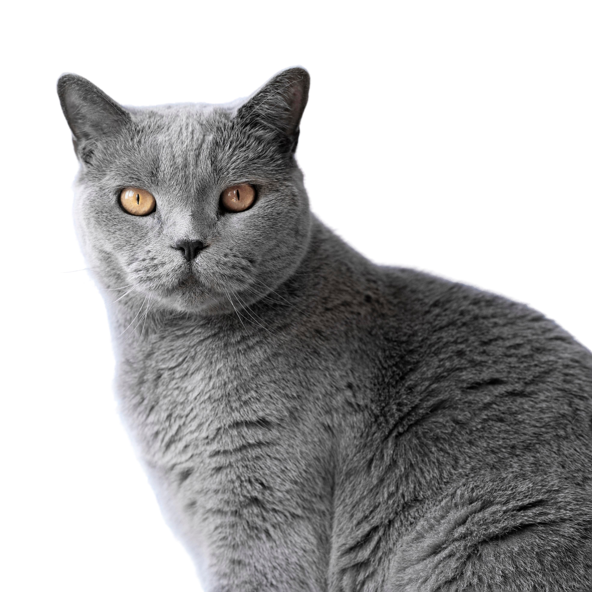

# Practica-II-VUFORIA

Autor: Eric Bermúdez Hernández

Email: alu0101517476@ull.edu.es

---

Para realizar la práctica se siguieron los pasos del guion de la práctica y se añadió la imagen del astronauta disponible en el campus virtual y una imagen de un gato cogida de internet. En el caso del astronauta, cuando se ejecuta en unity el proyecto y se detecta la imagen, aparece sobre ella un cubo verde. Por otro lado, si se detecta la imagen del gato, aparece sobre ella una esfera verde. Las imágenes que se han utilizado para el proyecto son las siguientes:

- Astronauta:

- Gato:

En el siguiente vídeo se puede apreciar el funcionamiento del proyecto descrito anteriormente: 

